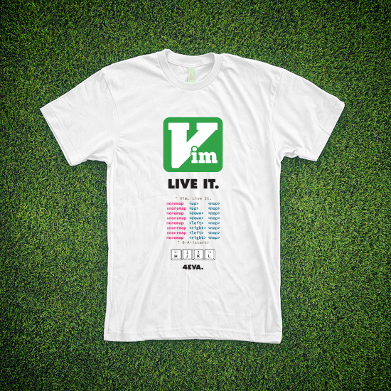

Vim Thing (revisited)
=====================

It's not enough to use vim, you've got to live it.

This is a slightly-modified version of [Tyler Cipriani](http://www.tylercipriani.com)'s [Vim. Live It.](http://www.tylercipriani.com/vim.html) graphic. I talked with Tyler a while back and he gave me the go-ahead to get some shirts printed-- this is basically the work-in-progress staging area for the graphics that I'll be sending to the printer.

Original image:

